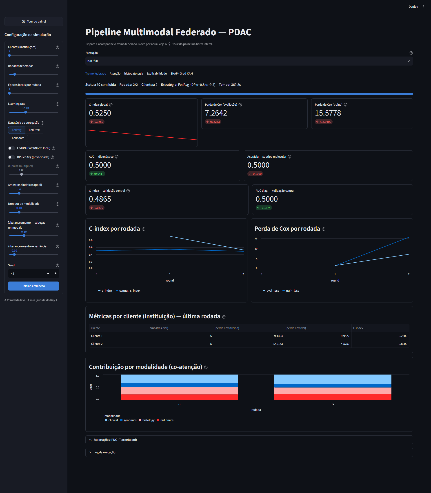

# Pipeline Multimodal Federado para PDAC

[](https://doi.org/10.5281/zenodo.22237065)

<!-- Para o badge apontar sempre à versão mais recente, troque pelo *concept DOI*
     (na página do Zenodo, em "Cite all versions"). -->

Implementação prática (mestrado — PPGI/UFRJ) de um modelo **multimodal** para
predição de **risco / sobrevida** em **adenocarcinoma ductal de pâncreas (PDAC)**,
treinado de forma **federada** (os dados de cada instituição nunca saem da
instituição).

> ⚠️ **Software as a Medical Device (SaMD) — pesquisa.** Este repositório é
> artefato de pesquisa acadêmica. Não é dispositivo médico aprovado e não deve
> ser usado para decisão clínica. Dados de pacientes estão sujeitos à LGPD e aos
> comitês de ética das instituições participantes.

---

## 1. Arquitetura

Três ramos independentes extraem uma representação (`embedding` de dimensão
`embed_dim`) de cada modalidade. Um módulo de **Atenção Cruzada (Cross-Modal
Attention)** funde os três `embeddings` e uma cabeça de risco produz o
log-hazard usado na perda de Cox.

```
   TC 3D (NIfTI) ──▶ Ramo A · Radiômico 3D      (MONAI DenseNet121 3D)  ─┐
                                                                        │
   WSI  ─(offline)▶ embeddings de patches ──▶ Ramo B · Histopatologia   ├─▶ Co-atenção
        (Foundation Model de patologia)      (Attention-MIL + Transf.)  │    cross-modal ──▶ risco
                                                                        │    par-a-par        (Cox PH)
   KRAS/TP53/SMAD4/CDKN2A ──▶ Ramo C · Genômico Tabular                 │    (MCAT) + [FUSION]
                              (Embedding por gene)                     ─┘
                                       │
                                       ▼
                         Aprendizado Federado (Flower)
                    servidor agrega pesos · clientes treinam local
```

### Ramo A — Radiômico 3D (`models/branch_a_radiomics.py`)
- **Entrada:** `(B, n_phases, D, H, W)` — fases **AP + VP** (`radiomics_phases=2`).
- **Backbone:** `DenseNet121` 3D da MONAI, **compartilhado entre as fases** (cada
  fase passa pelo mesmo encoder; vetores combinados por média, tokens por concat).
- **Saída:** `(B, embed_dim)` — ou `(B, n_phases·T, embed_dim)` (`return_tokens=True`),
  tokens espaciais (`token_grid` 2×2×2) para a co-atenção com a histologia.
- Pré-processamento esperado (offline): resample isotrópico, janelamento HU,
  crop/pad em torno da ROI pancreática.

### Ramo B — Histopatologia (`models/branch_b_histology.py`)
- **Não** processa pixels da WSI. Assume `embeddings` de patches gerados
  **offline** por um *foundation model* de patologia (UNI, CONCH, Prov-GigaPath…).
- **Entrada:** `(B, N, patch_feat_dim)` + máscara opcional `(B, N)` para *bags* de tamanho variável.
- **Agregador:** *Attention-Based MIL* (Ilse et al., 2018) + Transformer; `return_tokens=True`
  usa `histology_tokens` *slots* aprendíveis → `(B, K, embed_dim)` tokens histológicos.
- **Saída:** `(B, embed_dim)` (ou `(B, K, embed_dim)`) + pesos de atenção por patch.

### Ramo D — Clínico Tabular (`models/branch_d_clinical.py`)
- **Entrada:** `clinical_num (B, n_cont)` (contínuas, já em z-score) + `clinical_cat (B, n_cat)` (categóricas 0..k-1).
- Embedding de identidade por campo + `nn.Embedding` por categórica → 1 token/campo.
- Ativado por `enable_clinical` (config). Não está na Seção 6.1 estrita, mas na
  proposta geral e nos modelos "Patologia+Clínica" da revisão.

### Ramo C — Genômico Tabular (`models/branch_c_genomics.py`)
- **Entrada:** por gene `[KRAS, TP53, SMAD4, CDKN2A]` — `mutation_status` (wt/mut/
  desconhecido), `variant_type` (missense/nonsense/frameshift/splice/outra) e
  `vaf` ∈ [0,1]. Só `mutation_status` é obrigatório.
- Embeddings aprendíveis por `(gene, estado)` e `(gene, tipo de variante)` +
  projeção da VAF, somados por gene.
- **Saída:** `(B, embed_dim)` (via MLP) — ou `(B, 4, embed_dim)` (`return_tokens=True`),
  um token por gene *driver*.

### Fusão (`models/fusion_coattention.py` · `fusion_attention.py`)
Dois modos (`fusion_mode` em `configs/default.yaml`):
- **`coattention`** (padrão) — `CrossModalCoAttentionFusion`, estilo **MCAT**
  (Seção 6.1 do artigo): co-atenção **par-a-par e direcional** entre as sequências
  de tokens (Hist→Rad, Rad→Hist, Genômica como *Query* condicionante, etc.),
  `Attention(Q,K,V)=softmax(QKᵀ/√dₖ)V`; depois *pooling* por modalidade e leitura
  por token `[FUSION]`. Retorna também `modality_gate` (contribuição por modalidade).
- **`transformer`** (legado) — `CrossModalAttentionFusion`, auto-atenção conjunta
  sobre 1 token por modalidade + `[FUSION]`.
- **Robusto a modalidade ausente** (por amostra): máscara `(B, 3)`.
- **Saída:** `risk (B, n_outputs)`, `fused (B, embed_dim)`.

### Modelo completo (`models/multimodal_pdac.py`)
`MultimodalPDACModel` orquestra os quatro módulos e, sobre a representação
fundida, as **três tarefas clínicas da Figura 4**:
- **prognóstico** — `risk` (log-hazard, perda de Cox);
- **diagnóstico** — `dx_logit` (PDAC vs não-PDAC, BCE) — `enable_diagnosis`;
- **subtipagem molecular** — `subtype_logits` (classical/basal-like, cross-entropy) — `enable_subtype`.

Perda multitarefa em `utils.losses.multitask_loss` (pesos `w_diagnosis`,
`w_subtype`; rótulos ausentes mascarados). Avaliação: C-index · AUC (diagnóstico)
· acurácia (subtipo). É esta `nn.Module` cujos pesos o Flower agrega; cada ramo
pode ser **congelado** (`freeze_*`) para treinar apenas a fusão + cabeças.

### Aprendizado Federado (`federated/`)
- `server.py` — `start_server` + estratégia (`FedAvg` / `FedProx` / `FedAdam`),
  agregação de métricas ponderada por nº de amostras (denominador por chave).
  **Nenhum dado de paciente passa pelo servidor.**
  - **DP-FedAvg** (`federated.dp.enabled`) — clipping fixo da atualização de cada
    cliente + ruído gaussiano no agregado, no servidor
    (`DifferentialPrivacyServerSideFixedClipping`). O **orçamento ε** (RDP,
    Opacus) é estimado em `federated/privacy.py` e aparece no painel/`config.json`.
  - **FedBN** (`federated.fedbn`) — camadas BatchNorm ficam locais a cada cliente
    (Li et al. 2021); mitiga *shift* de distribuição entre instituições (não-IID).
  - **Avaliação centralizada** (`federated.central_eval`) — a cada rodada (e nos
    pesos iniciais) o modelo global é avaliado no servidor sobre uma coorte
    held-out; métricas `central_*` (C-index, AUC, acurácia) no painel/TensorBoard,
    lado a lado com a avaliação distribuída.
- `client.py` — `NumPyClient`: recebe pesos globais → treina local
  (`local_epochs`) → devolve pesos + métricas.
- `engine.py` — laços de treino/avaliação (perda de Cox, C-index).
- `simulation.py` — roda servidor + N clientes virtuais em um único processo.
- `config.py` — carrega `configs/default.yaml`.

---

## 2. Estrutura do repositório

```
pdac_multimodal_fl/
├── configs/
│   └── default.yaml          # hiperparâmetros de modelo / treino / federação
├── data/
│   ├── dataset.py            # MultimodalPDACDataset (manifesto CSV) + SyntheticPDACDataset
│   ├── preprocessing.py      # ct_transforms (MONAI) · load_patch_embeddings · parse_mutations
│   ├── manifest_template.csv # exemplo de manifesto
│   ├── raw/                  # dados brutos por instituição — NÃO versionado
│   └── processed/            # dados pré-processados — NÃO versionado
├── models/
│   ├── branch_a_radiomics.py
│   ├── branch_b_histology.py
│   ├── branch_c_genomics.py
│   ├── fusion_coattention.py   # co-atenção par-a-par (MCAT) — padrão
│   ├── fusion_attention.py     # auto-atenção conjunta — legado
│   └── multimodal_pdac.py
├── federated/
│   ├── server.py
│   ├── client.py
│   ├── engine.py             # laços de treino/avaliação (perda de Cox, C-index)
│   ├── simulation.py
│   ├── reporting.py          # RecordingStrategy + RunRecorder -> outputs/<run>/
│   └── config.py
├── utils/
│   ├── common.py             # seed, device, ponte de parâmetros ↔ Flower
│   └── losses.py             # cox_ph_loss, concordance_index
├── streamlit_app.py          # painel: dispara e acompanha a simulação "em tela"
├── .streamlit/config.toml    # tema (claro/escuro/sistema)
├── outputs/                  # métricas e modelos por execução — NÃO versionado
├── requirements.txt
└── README.md
```

---

## 3. Instalação

Requer **Python ≥ 3.10** (desenvolvido em 3.13).

```powershell
# Windows / PowerShell
.\venv\Scripts\Activate.ps1

# Instale o PyTorch adequado à sua GPU antes do restante:
#   https://pytorch.org/get-started/locally/
pip install -r requirements.txt
```

```bash
# Linux / macOS
source venv/bin/activate
pip install -r requirements.txt
```

---

## 4. Como executar localmente

### 4.1 Smoke test do modelo (sem dados)

Cada arquivo de modelo tem um bloco `__main__` com tensores fictícios:

```bash
python -m models.multimodal_pdac
python -m models.fusion_attention
```

### 4.2 Simulação federada (1 processo, recomendado para desenvolver)

Usa `SyntheticPDACDataset` particionado entre os clientes:

```bash
python -m federated.simulation --num-clients 3 --num-rounds 5
```

### 4.3 Federação "real" (servidor + clientes em terminais separados)

```bash
# Terminal 1 — servidor
python -m federated.server --num-rounds 10

# Terminal 2 — cliente 0
python -m federated.client --cid 0 --num-clients 2

# Terminal 3 — cliente 1
python -m federated.client --cid 1 --num-clients 2
```

Para federação entre máquinas, ajuste `federated.server_address` em
`configs/default.yaml` (ou passe `--server-address host:porta`) e garanta
conectividade/TLS entre os nós.

### 4.4 Painel (dashboard Streamlit)

```bash
streamlit run streamlit_app.py     # abre em http://localhost:8501
```



<sub>Execução sobre `SyntheticPDACDataset` (dados aleatórios) — as métricas não têm
significado clínico, servem para demonstrar o painel.</sub>

- **Barra lateral:** configura nº de clientes, rodadas, épocas locais, learning
  rate, estratégia (FedAvg/FedProx/FedAdam), amostras sintéticas e dropout de
  modalidade; **Iniciar simulação** dispara `federated/simulation.py` como
  subprocesso.
- **Aba "Treino federado":** auto-atualiza a cada 2 s — status/progresso, KPIs
  (C-index global, perda de Cox treino/avaliação), gráficos por rodada, tabela
  por cliente (instituição) e log do processo.
- **Aba "Atenção — histopatologia":** carrega o modelo global agregado e mostra
  os pesos de atenção do Ramo B (attention-MIL) sobre os patches.
- **Tour guiado:** abre automaticamente na primeira vez (flag `.tour_seen`) e a
  qualquer momento pelo botão **❔ Tour do painel** na barra lateral. Os controles
  e métricas têm *tooltips* (ícone `?`).
- **Tema claro/escuro:** menu ⋮ (canto superior direito) → *Settings* →
  *Appearance* → Light / Dark / System (configurável em `.streamlit/config.toml`).

Cada execução grava em `outputs/<run>/`: `config.json`, `status.json`,
`history.jsonl` (uma linha por rodada), `global_model.pt`, `tb/` (TensorBoard) e
`c_index.png` (ao final). O seletor **Execução** no topo do painel lista todas as
execuções para reabrir/comparar. `RecordingStrategy` (`federated/reporting.py`)
embrulha a estratégia do Flower para registrar as métricas sem alterar a agregação.

### 4.5 TensorBoard

```bash
tensorboard --logdir outputs        # abre em http://localhost:6006
```

Registrado por execução em `outputs/<run>/tb/`:

| Tipo | Tags |
|------|------|
| Scalars (por rodada) | `global/c_index`, `global/loss_eval`, `global/loss_train`, `clients/<Cliente N>/…` |
| Scalars (atenção) | `attention_branch_b/entropy_norm` — entropia normalizada da atenção do Ramo B (1.0 = uniforme, ~0 = concentrada) |
| Histogramas (por rodada) | `weights/branch_a`, `weights/branch_b`, `weights/branch_c`, `weights/fusion`, `attention_branch_b/weights` |
| Scalars locais (por cliente) | `local/train_loss` (por época), `local/eval_loss`, `local/c_index` — em `tb/local_cliente_<n>/` |

O gráfico **`c_index.png`** (C-index + perdas de Cox × rodada) é gerado ao final
de cada execução e aparece no painel em *Exportações*.

### 4.6 Explicabilidade (`utils/xai.py`, aba do painel)

- **Grad-CAM 3D** no Ramo A — retropropaga o risco fundido até o mapa de features
  do DenseNet3D; heatmap sobreposto a uma fatia da TC.
- **SHAP genômico** no Ramo C — valores SHAP por gene *driver* (KRAS/TP53/SMAD4/
  CDKN2A) sobre a cabeça de risco **unimodal** da fusão (`fusion_aux_heads=true`).

### 4.7 Balanceamento entre modalidades

`utils.losses.multimodal_cox_loss` soma à perda de Cox da fusão: `lambda_aux` ×
(média das perdas de Cox unimodais) + `lambda_balance` × (variância entre elas).
Cabeças unimodais vêm de `fusion_aux_heads`. O peso do token `[FUSION]` sobre cada
modalidade (`modality_gate`) é agregado por rodada e mostrado no painel/TensorBoard.

### 4.8 Testes e lint

```bash
ruff check .        # lint (config em ruff.toml)
pytest              # suíte em tests/ (~30 testes; shapes dos ramos, fusão,
                    # máscara de modalidade, perdas, engine, federado, XAI)
```

CI em `.github/workflows/ci.yml` (ruff + pytest a cada push/PR na `main`).

---

## 5. Ligando os seus dados

`MultimodalPDACDataset` (`data/dataset.py`) + `data/preprocessing.py` já
implementam o carregamento a partir de um **manifesto CSV**
(`data/manifest_template.csv`). Colunas — as de modalidade são opcionais
(célula vazia = modalidade ausente):

| coluna | conteúdo |
|---|---|
| `patient_id` | obrigatória |
| `ct_ap`, `ct_vp` **ou** `ct_path` | NIfTI de TC (fases AP/VP, ou 1 volume) |
| `wsi_emb` | `.npy`/`.pt` com os embeddings de patches `(N, F)` (UNI/Virchow, offline) |
| `mutations` **ou** `<GENE>_status`,`<GENE>_vtype`,`<GENE>_vaf` | MAF (TCGA) / CSV, ou colunas diretas |
| `time`, `event` | sobrevida |
| `dx`, `subtype` | diagnóstico (0/1) e subtipo (0/1); vazio/`-1` = desconhecido |
| `split` | `train` / `val` / `test` |

O pré-processamento da TC (`ct_transforms`: resample isotrópico → janelamento HU
pancreático → crop da ROI → resize) roda **na hora** no `Dataset`; a extração de
patches/embeddings da WSI é feita **offline** (fora deste repo).

Passos:

1. Gere os arquivos por paciente e o `manifest.csv`.
2. Aponte `data.manifest_csv` / `data.data_root` em `configs/default.yaml`
   (e `federated.central_eval.manifest` para a coorte held-out do servidor).
3. Rode `python -m federated.simulation --config <seu>.yaml ...` — o
   `build_dataloaders` já usa `MultimodalPDACDataset` quando `manifest_csv` está
   preenchido (senão, cai no `SyntheticPDACDataset`).

---

## 6. Convenções

- `embed_dim` é **compartilhado** pelos três ramos e pela fusão — altere em um
  único lugar (`configs/default.yaml`).
- A ordem canônica das modalidades é `("radiomics", "histology", "genomics")`
  (ver `models/fusion_attention.MODALITIES`).
- A ordem canônica dos genes é `("KRAS", "TP53", "SMAD4", "CDKN2A")`
  (ver `models/branch_c_genomics.PDAC_DRIVER_GENES`).
- Nada em `data/raw/` ou `data/processed/` é versionado (`.gitignore`).

---

## 7. Roadmap

Alinhamento com a Seção 6.1 do artigo:

- [x] Fusão por **co-atenção cross-modal par-a-par (MCAT)** — `fusion_coattention.py`.
- [x] Ramo A emite **tokens espaciais**; Ramo B emite **K tokens** histológicos;
  Ramo C emite **1 token por gene** *driver*.
- [x] Regularização de **balanceamento entre modalidades** no treino
  (`multimodal_cox_loss`: cabeças unimodais + `lambda_aux`/`lambda_balance`;
  `modality_gate` por rodada no painel/TensorBoard).
- [x] Explicabilidade: **SHAP** genômico (Ramo C) e **Grad-CAM 3D** (Ramo A) —
  `utils/xai.py` + aba *Explicabilidade* do painel.
- [x] Ramo A: fases **AP + VP** com **encoder 3D compartilhado** (`radiomics_phases=2`).
- [x] Ramo C: **tipo de variante + VAF** além do status mutacional.
- [x] Cabeças **multitarefa**: prognóstico + diagnóstico + subtipagem molecular
  (Figura 4) — `multitask_loss`; AUC/acurácia por rodada no painel/TensorBoard.
- [x] Privacidade: **DP-FedAvg** (server-side fixed clipping + ruído) — `federated.dp`.
- [x] Não-IID: **FedBN** (BatchNorm local por cliente) — `federated.fedbn`.
- [x] **Avaliação centralizada no servidor** (`federated.central_eval`) — métricas `central_*`.
- [x] Testes **`pytest`** (`tests/`, 34 testes) + **CI** (`.github/workflows/ci.yml`) + `ruff`.
- [x] **`MultimodalPDACDataset`** (manifesto CSV) + **`data/preprocessing.py`**
  (MONAI transforms de TC, pad de patches de WSI, parser MAF/CSV de mutações).
- [x] **Ramo D clínico** + **SHAP clínico** (`utils/xai.clinical_shap`, aba do painel).
- [x] Contador de **ε** (RDP, Opacus) — `federated/privacy.py`.
- [x] *Scaffold* de extração de patches/embeddings de WSI (`data/wsi_patching.py`,
  encoders UNI/Virchow/CONCH plugáveis; **rodar offline, fora do repo**).
- [ ] *Secure aggregation* (SecAgg+) — exige migrar p/ `flwr run` / `ServerApp`.
- [ ] Rodar com **dados reais** + **validação externa multicêntrica** → ver
  [`docs/GUIA_DE_DADOS.md`](docs/GUIA_DE_DADOS.md) (o que cabe a você fazer).

Geral:

- [ ] Implementar `MultimodalPDACDataset` para o(s) dataset(s) reais.
- [ ] Pipeline de pré-processamento de TC (MONAI transforms) e extração de patches/embeddings de WSI.
- [ ] Avaliação centralizada no servidor com coorte de validação externa.
- [ ] Privacidade: *secure aggregation* / DP-SGD (`flwr` + Opacus).
- [ ] Estratégias para não-IID entre instituições (FedProx / FedBN).
- [ ] Testes (`pytest`) para shapes dos ramos, máscara de modalidade e `cox_ph_loss`.

---

## 8. Licença

Código sob licença **MIT** — ver [`LICENSE`](LICENSE).

Os **dados de pacientes não são cobertos** por esta licença e permanecem sob a
LGPD e sob os termos dos comitês de ética e dos acordos de uso de dados de cada
instituição participante.
